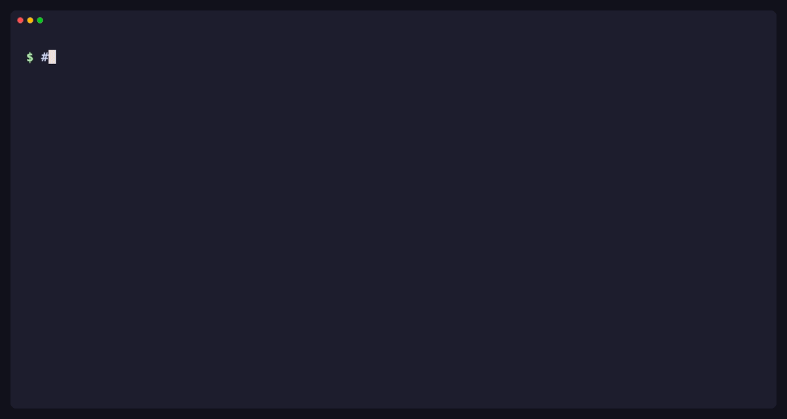
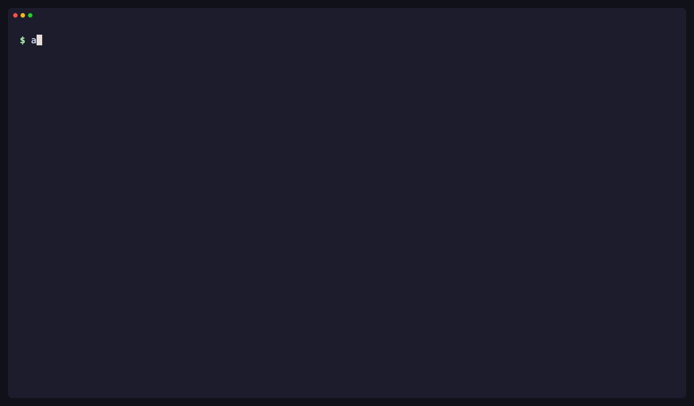

# Examples

Runnable scenarios, from capturing a diff to catching a duplicate payment charge.
Each script builds a small throwaway Git project, runs the real `bin/after`, and
walks through a few numbered steps. Every step shows the exact command and
AFTER's own colored output, and each scenario ends by contrasting what a plain
diff shows with what AFTER shows.

```sh
task build
examples/cli/03-moved-oracle.sh
```

| Same responses, double charge ([05](cli/05-payment-experiment.sh)) | Green tests, moved oracle ([03](cli/03-moved-oracle.sh)) |
| ------------------------------------------------------------------ | -------------------------------------------------------- |
|          |           |



Install Go and jq and ensure they are on `PATH`. On a terminal, scripts pause
before each step; press Enter to continue, or set `AFTER_EXAMPLES_STEP=0` to run
straight through. `NO_COLOR=1` disables color. Workspaces are kept under
`$TMPDIR/after-example-*` so you can explore them afterwards; move them to Trash
when done. `task examples` runs every example that needs no Docker as a smoke
test (TUI setup only, not interactive key presses). The report examples run
their synthetic Go tests on the host; AFTER only imports the output.

Scripts use bare commands (`after capture`, `after diff`, `after run`) and short
IDs, the way you would type them. They call `--json` silently only to look up an
ID for a later step. See [CLI.md](../docs/CLI.md) for the full grammar.

The GIFs are recorded with [VHS](https://github.com/charmbracelet/vhs) from the
tapes in [demos/](demos), using the same fixtures as the scripts. `task demo:gifs`
regenerates them; it needs `ttyd` on `PATH` and the Docker setup below.

## CLI

| Script                                                   | Scenario                                                                    | Shows                                                                          |
| -------------------------------------------------------- | --------------------------------------------------------------------------- | ------------------------------------------------------------------------------ |
| [01-working-tree](cli/01-working-tree.sh)                | Raise a rate limit, forget the docs, leave a scratch file                   | Stale-capture `status`, live vs `--stored` `diff`, `inspect`, untracked opt-in |
| [02-staged-and-branches](cli/02-staged-and-branches.sh)  | Commit a fix but not a debug edit; review a feature branch after main moved | `--staged`, clean-tree guidance, `--base main --target feature`                |
| [03-moved-oracle](cli/03-moved-oracle.sh)                | Discount changes and its test is edited to agree; the suite stays green     | Stdin `import` with automatic binding, moved oracle, failing frozen tests      |
| [04-config](cli/04-config.sh)                            | Team YAML defaults overridden by environment and flags                      | `config` provenance, fail-fast validation, no consent setting                  |
| [05-payment-experiment](cli/05-payment-experiment.sh) 🐳 | Four payment-service changes, run before and after in the offline sandbox   | `run` consent, observed provider requests, exit codes                          |
| [06-pin-reopen-rerun](cli/06-pin-reopen-rerun.sh) 🐳     | Reviewer pins "one charge per retry"; the fix reopens it; rerun; accept     | `pin --select/--attach/--accept`, immutable revision history                   |

`05-payment-experiment.sh` takes a variant. Each runs the same frozen requests:
`POST /payments`, then a retry with the same `Idempotency-Key` after 12 hours and after 30 seconds.

| Variant               | Change                                     | HTTP responses | Provider requests (12h / 30s) | `after` exit |
| --------------------- | ------------------------------------------ | -------------- | ----------------------------- | ------------ |
| `retention` (default) | 24h → 5 min retention                      | identical      | 1→2 / 1→1                     | 4            |
| `refactor`            | `24 * 60 * 60` → `86400`                   | identical      | 1→1 / 1→1                     | 0            |
| `no-dedup`            | idempotency disabled                       | identical      | 1→2 / 1→2                     | 4            |
| `fake-log`            | app prints a false request count to stdout | identical      | 1→1 / 1→1                     | 0            |

The responses never change, so response snapshots and a reviewer reading the diff
can both miss the duplicate charge. `fake-log` shows that AFTER counts what the fake
provider received and ignores what the app reports about itself.

## TUI

Each script prepares state, prints a short key guide, then opens the TUI after
you press Enter. Set `AFTER_EXAMPLES_PREPARE_ONLY=1` to prepare without opening
(the payment example still requires consent and Docker for its initial run).
The raw-review example uses plain `after review`: it saves the review and resumes
it on the next launch; `after review --new` starts fresh without deleting evidence.
The report and payment examples open explicit stored pairs/evidence, without
reading or updating that saved session.

Use `1`–`4` or Tab/Shift+Tab for Overview/Changes/Diff/Activity; the frame identifies
the project and snapshot sources. `/` searches, `n`/`N` cycles matches, and Diff
supports `]`/`[` for files and `}`/`{` for hunks. After an external edit, `c` captures
and `u` offers original-base or last-inspected comparison (Left/Right), then
confirms the exact selected pair with a reason. `p`, `u`, and eligible
`a` actions name exact target IDs and ask for a reason; Esc cancels. Duplicate pins
with the same basis receipt and expectation are refused. `a` accepts a pin's current
complete result, not a snapshot. Contextual footer hints and grouped `?` help explain
which actions are available.

| Script                                                     | Scenario                                                                           |
| ---------------------------------------------------------- | ---------------------------------------------------------------------------------- |
| [01-raw-review](tui/01-raw-review.sh)                      | Rename, deletion, binary asset, mode change, edited golden file, uncaptured secret |
| [02-test-reports](tui/02-test-reports.sh)                  | Shipping threshold moves; green candidate suite beside a failing frozen-oracle run |
| [03-payment-review-loop](tui/03-payment-review-loop.sh) 🐳 | Pin known-good behavior, apply a regression, watch the pin reopen, rerun, catch it |

## 🐳 Docker examples

These execute the captured code, so they need the offline sandbox. Provision the
pinned image once ([SANDBOX.md](../docs/SANDBOX.md)), then set both variables.
`after config` prints a ready `export` line when it finds one Docker CLI and one
socket, or set them yourself:

```sh
export AFTER_DOCKER_BINARY="$(command -v docker)"
export AFTER_DOCKER_HOST="$(docker context inspect --format '{{.Endpoints.docker.Host}}')"
```

Every run first stores an exact private plan in `.after/`, displays its consent
summary, and asks you to type `yes` on the terminal; anything else runs nothing.
There is no blanket consent. Scripts and CI can approve a stored plan with
`after run --approve <full-digest>`. Each run takes up to a couple of minutes.
Payment data is synthetic; the sandbox has no external network (app-to-observer
traffic uses its isolated internal network).
